# Men's Hair Salon Management System

## 📖 Overview

Men's Hair Salon Management System is a modern and user-friendly web application designed to automate and streamline salon operations. Built with PHP, MySQL, JavaScript, HTML and CSS, it simplifies tasks like real-time appointment booking, membership management, inventory tracking, and secure payments. By replacing manual processes, the system improves efficiency, reduces errors, and enhances the overall customer experience for grooming salons.

This web-based system simplifies salon operations by automating key functions such as:

- 📅 Customer appointment bookings
- 💳 Membership management (Royal, Classic, Standard)
- 💇‍♂️ Service offerings (Haircuts, Beard Trims, Skin Treatments, Spa Services)
- 🧴 Inventory tracking (Haircare, Beardcare, Skincare products)
- 💰 Secure payment processing & transaction tracking

Built using PHP and MySQL, the system offers a user-friendly interface that improves operational efficiency and customer satisfaction.

---

## 🧩 Key Features

- ✅ **Real-time Appointment Scheduling**  
  Book, view, update, and cancel appointments in real-time.

- 👑 **Membership Plans**  
  Manage exclusive memberships: Royal, Classic, and Standard.

- 💆 **Service Management**  
  Add, update, or remove services based on customer needs.

- 🗃️ **Inventory Control**  
  Track and manage stock levels of salon products efficiently.

- 💳 **Payment & Transaction Management**  
  Seamlessly handle billing and generate payment receipts.

- 💼 **Wallet System for Cancellations**  
  When a user cancels a booking, the refunded amount is securely credited to their in-app wallet for future use.

- 📊 **Reports & Analytics**  
  Generate business performance reports to track sales and appointments.

- 🔐 **Secure Admin Panel**  
  Authorized access with password-protected login.

---

## 🛠️ Technologies Used

| Technology | Description               |
|------------|---------------------------|
| PHP        | Backend scripting language |
| MySQL      | Relational database       |
| HTML5/CSS3 | Frontend design           |
| JavaScript | Interactive UI elements   |

---

## 🖼️ Project Screenshots

Here are some visuals of the system:

### 🔹 HomePage

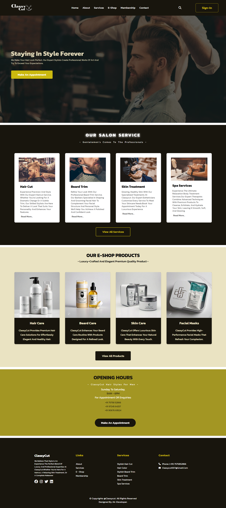

### 🔹 AboutPage

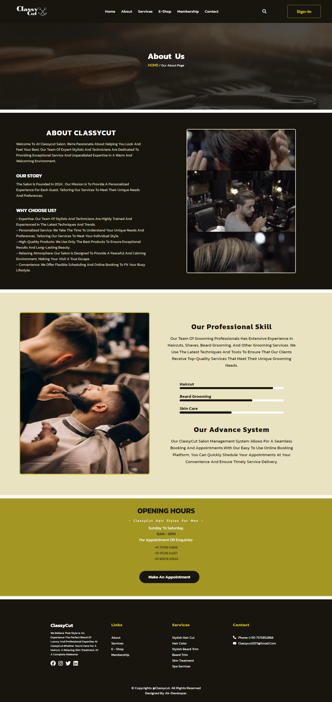

### 🔹 ServicePage

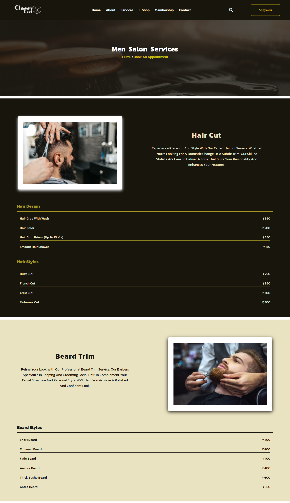

### 🔹 E-shop

### 🔹 MemberShip

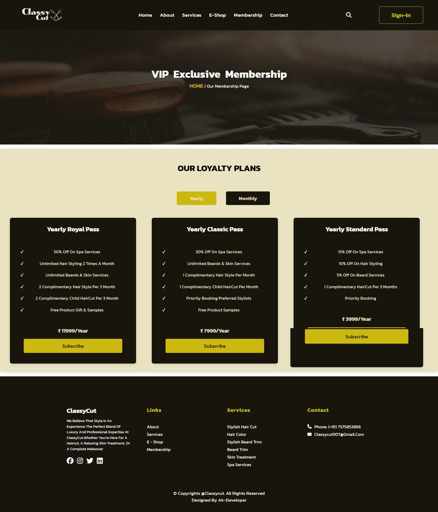

### 🔹 ContactPage

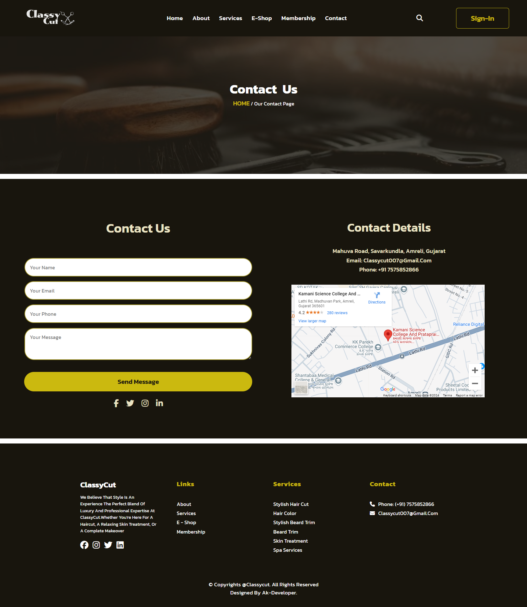

### 👤 User Panel

#### 📊 Dashboard

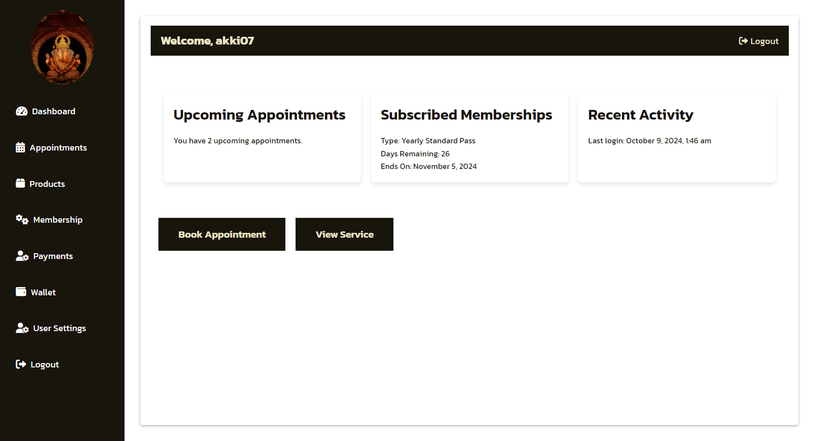

#### 📅 Appointment Booking

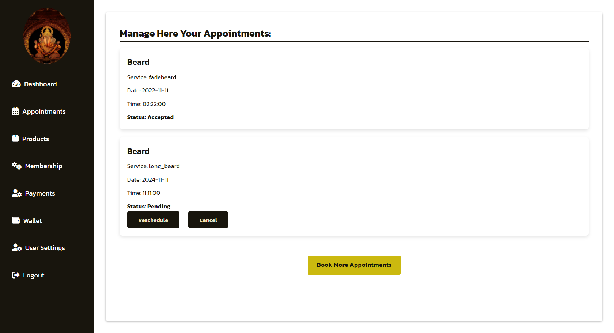

#### 🛒 Shopping Cart

#### 💼 User Wallet

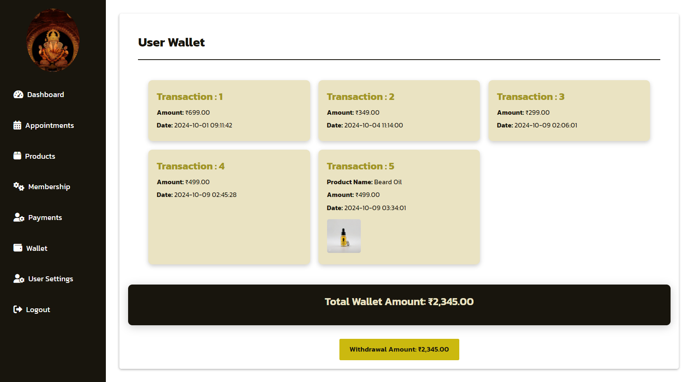

#### 💳 Payment Page  

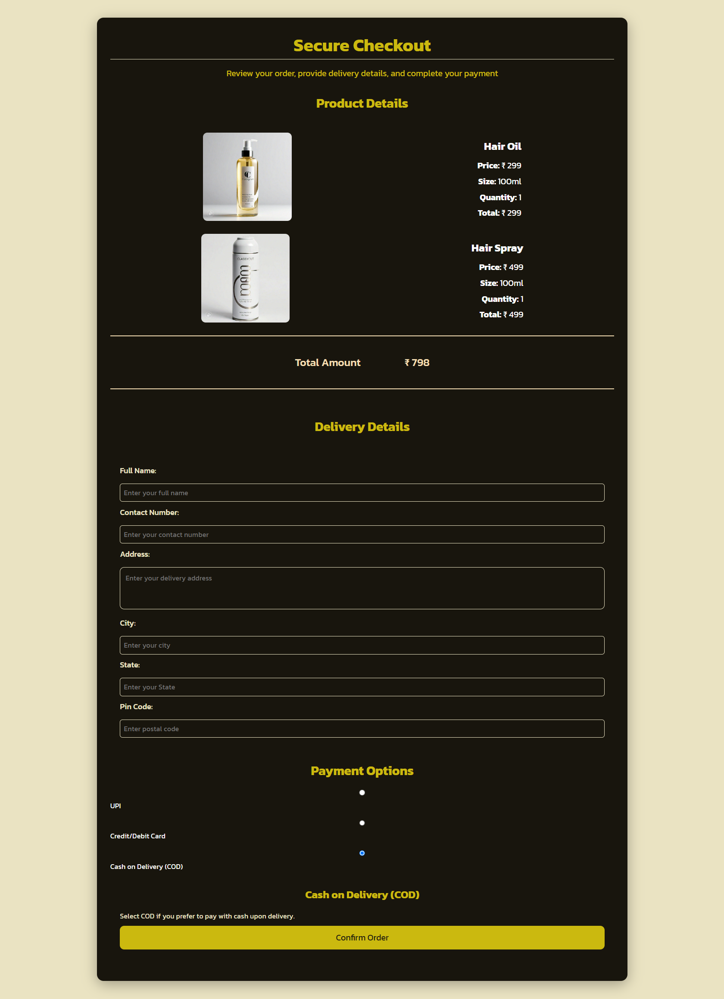

---

### 🧑‍💼 Admin Panel

#### 📊 Dashboard

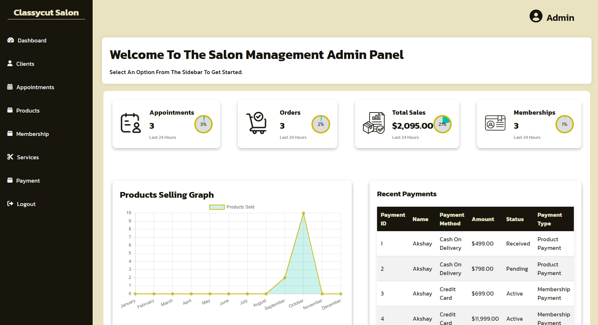

#### 📦 Orders Management

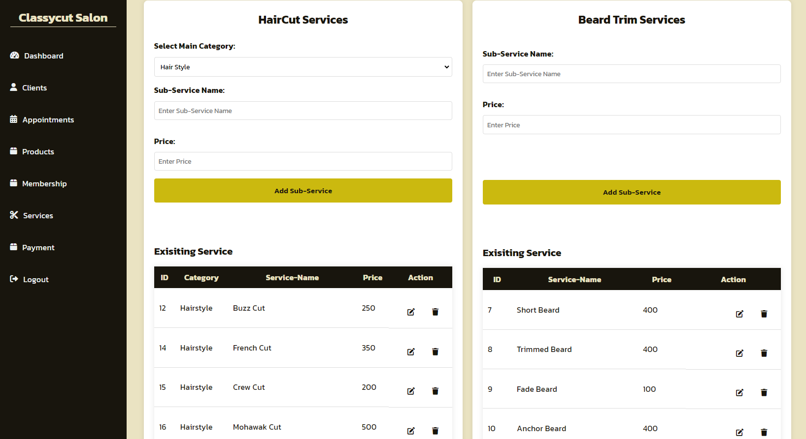

#### 🧴 Products Management

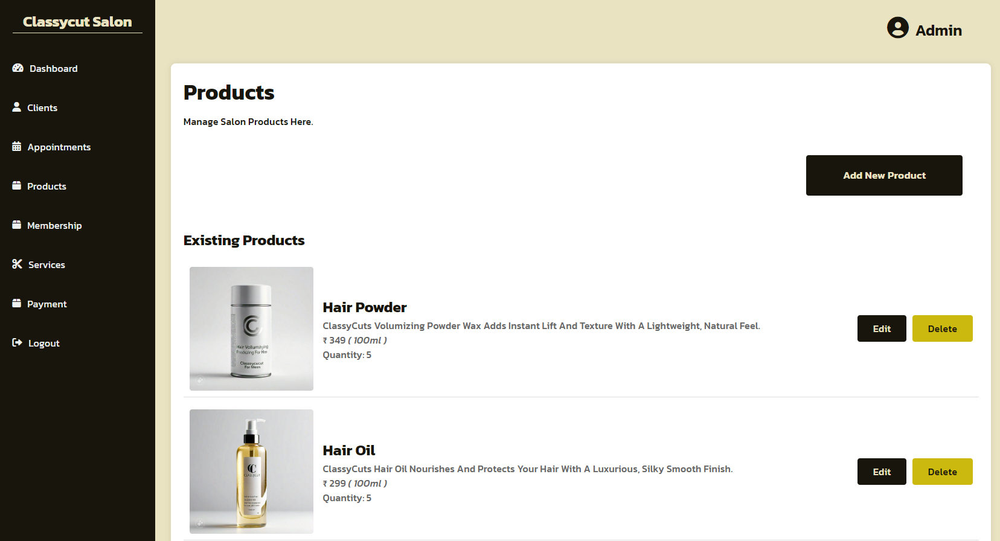

---
